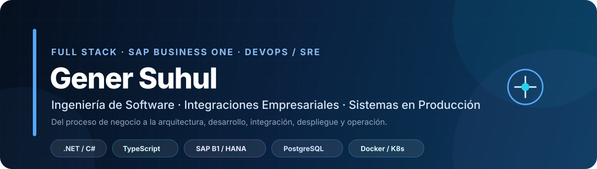
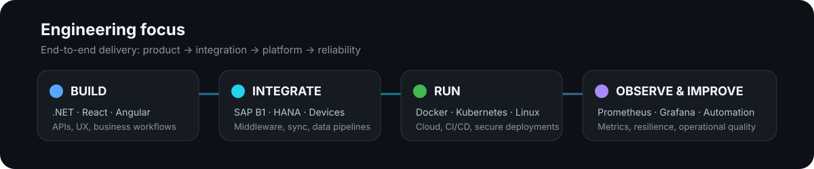
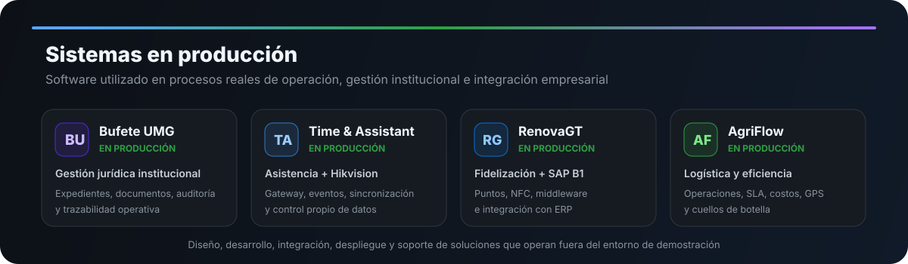
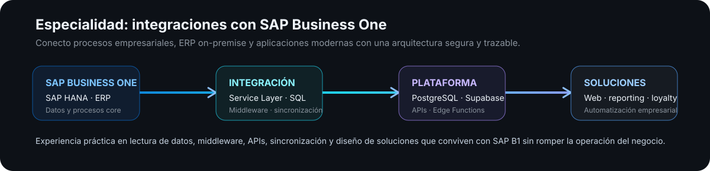

<p align="center">
  
</p>

<p align="center">
  <a href="https://github.com/GenerSuhul"></a>
  <a href="mailto:gsuhula1@miumg.edu.gt"></a>
  
</p>

<p align="center">
  
  
  
  
  
</p>

## Sobre mí

Soy **Desarrollador Full Stack y profesional de IT** enfocado en construir soluciones empresariales que llegan a producción y resuelven problemas operativos reales.

Mi perfil combina **ingeniería de software, SAP Business One, SAP HANA, bases de datos, integraciones empresariales, infraestructura y DevOps**. Puedo participar en todo el ciclo: entender el proceso, modelar la solución, desarrollar frontend y backend, integrar sistemas, desplegar, observar el comportamiento en producción y resolver incidentes.

> **Mi mayor fortaleza es conectar software moderno con la realidad operativa de una empresa: ERP, usuarios, dispositivos, logística, datos, infraestructura y continuidad del servicio.**

<p align="center">
  
</p>

## Sistemas Destacados en Produccion

Los proyectos que más representan mi experiencia **se encuentran actualmente en producción**. Son sistemas utilizados en procesos institucionales y empresariales donde la trazabilidad, seguridad, disponibilidad y calidad de los datos importan de verdad.

<p align="center">
  
</p>

Esto significa que mi trabajo no termina cuando una aplicación compila. También considero:

- operación diaria y experiencia del usuario;
- permisos y separación de responsabilidades;
- calidad y consistencia de datos;
- manejo de errores y trazabilidad;
- seguridad de credenciales y servicios;
- documentación y soporte;
- despliegues, observabilidad y mantenimiento;
- evolución del sistema después de su puesta en marcha.

---

## Especialidad: SAP Business One + SAP HANA

<p>
  
  
  
  
</p>

SAP Business One es una de las áreas centrales de mi perfil. He trabajado diseñando soluciones que **extienden el ERP sin convertir las aplicaciones externas en islas de información**.

<p align="center">
  
</p>

Mi experiencia incluye:

- **SAP Business One / SAP HANA** como núcleo de procesos empresariales;
- integración mediante **Service Layer**;
- consultas y extracción mediante **SAP HANA SQL**;
- middleware entre infraestructura **on-premise y cloud**;
- sincronización de clientes, ventas, inventario y otros datos operativos;
- diseño de APIs intermedias para evitar exponer el ERP directamente al frontend;
- integración de aplicaciones modernas con PostgreSQL / Supabase alrededor del ecosistema SAP;
- manejo de trazabilidad, errores, reintentos y consistencia entre sistemas.

Mi enfoque es mantener claro **qué sistema es la fuente de verdad**, dónde debe vivir cada regla y cómo integrar sin poner en riesgo el proceso principal del ERP.

---

# Sistemas destacados en producción

## `buefete-umg` — Plataforma jurídica institucional

<p>
  
  
  
</p>

Sistema institucional utilizado en la oficina de la **Universidad Mariano Gálvez de Guatemala** para centralizar la gestión jurídica y académica del Bufete Popular / Clínica Jurídica.

**Problema que resolvió**

La operación jurídica requiere manejar clientes, expedientes, alumnos, documentos, seguimiento procesal, revisiones y trazabilidad. Llevar estas actividades de forma fragmentada dificulta consultar el estado real de un caso, conocer quién realizó una acción y mantener organizada la documentación.

**Lógica de la solución**

- expediente digital por cliente y caso;
- administración de usuarios, roles y permisos;
- asignación y seguimiento de casos jurídicos;
- cronología procesal y actividad del expediente;
- memoriales, revisiones, presentaciones y notificaciones;
- digitalización y gestión documental multipágina;
- almacenamiento privado y versionado de archivos;
- búsqueda, reportes y auditoría;
- integración con escáner local;
- arquitectura por capas con backend y frontend desacoplados.

**Impacto operativo**

Centraliza información que antes podía quedar distribuida entre personas, archivos y actividades independientes; mejora la trazabilidad de los expedientes y proporciona una herramienta institucional diseñada alrededor del flujo real de trabajo jurídico.

**Stack:** `.NET 10` · `ASP.NET Core` · `React 19` · `TypeScript` · `PostgreSQL` · `EF Core` · `S3 / MinIO` · `Docker` · `GitHub Actions`

[Referencia del repositorio — acceso restringido](https://github.com/GenerSuhul/buefete-umg)

---

## [`time-and-asistant`](https://github.com/GenerSuhul/time-and-asistant) — Control de asistencia e integración Hikvision

<p>
  
  
  
</p>

Plataforma propia para capturar, procesar y consultar eventos de asistencia provenientes de dispositivos Hikvision, reduciendo la dependencia de plataformas cerradas y dando control directo sobre el flujo de información.

**Problema que resolvió**

Los eventos de asistencia se originan en dispositivos físicos y deben convertirse en información confiable para operación y reportes. Depender totalmente de software de terceros limita el control sobre integraciones, históricos, reglas y evolución del sistema.

**Lógica de la solución**

```text
Dispositivo Hikvision
        |
        v
ISUP / EHome / ISAPI
        |
        v
Device Gateway - Node.js + TypeScript
        |
        v
Supabase PostgreSQL + Edge Functions
        |
        v
React Web App
```

- gateway propio para recepción de eventos;
- comunicación mediante ISUP/EHome e ISAPI;
- sincronización y recuperación histórica;
- almacenamiento estructurado en PostgreSQL;
- frontend React para consulta y administración;
- permisos y separación de datos de desarrollo/producción;
- despliegue del gateway en Linux con PM2;
- diseño preparado para trabajar con dispositivos reales, no datos simulados en producción.

**Impacto operativo**

Permite controlar directamente el ciclo del dato de asistencia: desde el dispositivo hasta el reporte. Esto mejora la capacidad de diagnóstico, automatiza la consolidación de eventos y reduce la dependencia tecnológica de una única plataforma propietaria.

**Stack:** `React` · `TypeScript` · `Node.js` · `Supabase` · `PostgreSQL` · `Edge Functions` · `Linux` · `PM2`

---

## `renovagt` — Fidelización empresarial integrada con SAP Business One

<p>
  
  
  
</p>

Sistema empresarial de **fidelización y puntos** conectado al ecosistema de SAP Business One. Es uno de los proyectos que mejor representa mi enfoque de integración entre software moderno y procesos reales de ERP.

**Problema que resolvió**

Un programa de fidelización necesita operar alrededor de ventas, clientes y reglas comerciales existentes. Si se construye completamente separado del ERP, aparecen duplicidad de datos, procesos manuales y riesgo de inconsistencias.

**Lógica de la solución**

- SAP Business One / SAP HANA se mantiene como pieza central del ecosistema empresarial;
- middleware para comunicar infraestructura local con servicios cloud;
- lógica de acumulación y utilización de puntos;
- identificación mediante tarjetas NFC;
- separación entre datos propios de fidelización y datos maestros/transaccionales del ERP;
- APIs intermedias para evitar acceso directo del frontend a SAP;
- validaciones y reglas para mantener trazabilidad de las operaciones;
- experiencia web para operación y administración.

**Impacto operativo**

Convierte la fidelización en un proceso integrado al ecosistema empresarial en lugar de una herramienta aislada. Automatiza el flujo de puntos, mantiene alineados los datos relevantes con SAP B1 y crea una base tecnológica sobre la que el programa puede evolucionar sin comprometer la operación del ERP.

**Stack actual:** `React 19` · `TypeScript` · `TanStack Start` · `TanStack Router` · `TanStack Query` · `Supabase` · `Tailwind CSS 4` · `Zod` · `Recharts`

[Referencia del repositorio — acceso restringido](https://github.com/GenerSuhul/renovagt)

---

## `agriflow-system` — Plataforma de logística y eficiencia operativa

<p>
  
  
  
</p>

Plataforma de logística construida para transformar operaciones de transporte en un flujo trazable, medible y administrable desde una sola aplicación.

**Problema que resolvió**

En logística no basta con saber que “salió un camión”. Es necesario conocer qué operación se realiza, quién conduce, qué vehículo se utiliza, origen y destino, tiempos reales, evidencia, costos, devoluciones y si existen retrasos o cuellos de botella. Sin una plataforma central, esta información termina fragmentada y es difícil convertirla en decisiones operativas.

**Lógica del sistema**

AgriFlow modela dos grandes flujos:

```text
Envío a cliente
Origen -> Conductor/Camión -> Carga -> Traslado -> Entrega -> Evidencia -> Cierre

Traslado entre sucursales
Sucursal origen -> Conductor/Camión -> Traslado -> Sucursal destino -> Registro -> Cierre
```

Cada operación puede administrar:

- sucursal de origen y, cuando corresponde, sucursal destino;
- conductor, camión, placas y tipo de operación;
- envío a cliente o traslado interno;
- prioridad, tipo de carga, peso y volumen estimado;
- kilómetros estimados/reales y duración prevista;
- peajes, viáticos, hospedaje y estimación de costos;
- ventanas de entrega y objetivos SLA;
- evidencia documental asociada a la operación;
- registro de eventos con fecha/hora y coordenadas GPS;
- devoluciones asociadas a una operación;
- historial y trazabilidad de cambios;
- roles diferenciados para administración, operación, control de calidad y conductores.

El módulo de eficiencia transforma los eventos operativos en métricas de **espera, carga, traslado, descarga y tiempo total**, compara tiempos reales contra umbrales configurables y detecta automáticamente cuellos de botella. También permite analizar desempeño por sucursal, conductor y camión, relacionar costos/ingresos y exportar información para análisis.

**Impacto operativo**

AgriFlow convierte una operación logística dispersa en información estructurada y accionable. Aporta una vista única del proceso, mejora la trazabilidad desde la creación hasta el cierre, permite detectar dónde se pierde tiempo y ofrece datos reales para tomar decisiones sobre eficiencia, recursos y cumplimiento operativo.

**Stack:** `React 18` · `TypeScript` · `Supabase` · `PostgreSQL` · `TanStack Query` · `Recharts` · `Zod` · `PWA` · `PDF/Excel`

[Referencia del repositorio — acceso restringido](https://github.com/GenerSuhul/agriflow-system)

---

## Lo que aporto a un equipo

| Área | Aporte |
|---|---|
| **Desarrollo Full Stack** | Construcción de aplicaciones completas: frontend, backend, APIs, autenticación, permisos, datos y UX. |
| **SAP Business One** | Service Layer, SAP HANA SQL, middleware, sincronización e integración de aplicaciones empresariales con el ERP. |
| **Sistemas en producción** | Experiencia llevando soluciones fuera del entorno de desarrollo y adaptándolas al uso operativo real. |
| **Arquitectura** | Separación de responsabilidades, contratos API, modelado de datos, flujos end-to-end y diseño mantenible. |
| **DevOps / Operación** | Docker, Kubernetes, Linux, CI/CD, GitHub Actions, despliegues, observabilidad y troubleshooting. |
| **IT + negocio** | Capacidad para entender el proceso operativo antes de convertirlo en código. |

---

## Stack técnico

### Desarrollo

<p>
  
</p>

### Datos e integración

<p>
  
</p>

**También:** SAP Business One · SAP HANA · Service Layer · SQL Server · Oracle Database · EF Core · REST APIs · JWT · RLS · Zod · TanStack Query

### Infraestructura y entrega

<p>
  
</p>

**También:** Prometheus · Grafana · PM2 · VPS · Docker Compose · CI/CD · observabilidad · networking · troubleshooting de producción

---

## Cómo abordo un sistema

```text
Problema operativo
      |
      v
Proceso y reglas de negocio
      |
      v
Arquitectura + modelo de datos
      |
      v
Backend + Frontend + Integraciones
      |
      v
Seguridad + pruebas + automatización
      |
      v
Despliegue a producción
      |
      v
Observabilidad + soporte + mejora continua
```

No considero un sistema terminado únicamente porque funciona en mi equipo. Me interesa que sea **operable, trazable, mantenible y útil para las personas que dependen de él**.

---

## Actividad en GitHub

<p align="center">
  
  
</p>

<p align="center">
  
</p>

<p align="center">
  
</p>

> Varios de mis sistemas más importantes son repositorios privados porque contienen soluciones institucionales o empresariales en producción. Por esa razón, las estadísticas públicas de GitHub no representan la totalidad de mi experiencia ni del software que mantengo.

---

## Áreas donde puedo generar valor

**Full Stack Development** · **Backend .NET / C#** · **React / Angular / TypeScript** · **SAP Business One** · **SAP HANA** · **Integraciones ERP** · **PostgreSQL** · **Arquitectura de APIs** · **DevOps / SRE** · **Docker / Kubernetes** · **Automatización** · **Sistemas empresariales** · **Logística**

Si un reto requiere entender **software, integración, infraestructura, operación y negocio al mismo tiempo**, es el tipo de problema en el que más valor puedo aportar.

---

<p align="center">
  <b>Gener Suhul</b><br/>
  Full Stack Developer · SAP Business One · Integraciones Empresariales · Sistemas en Producción
</p>
